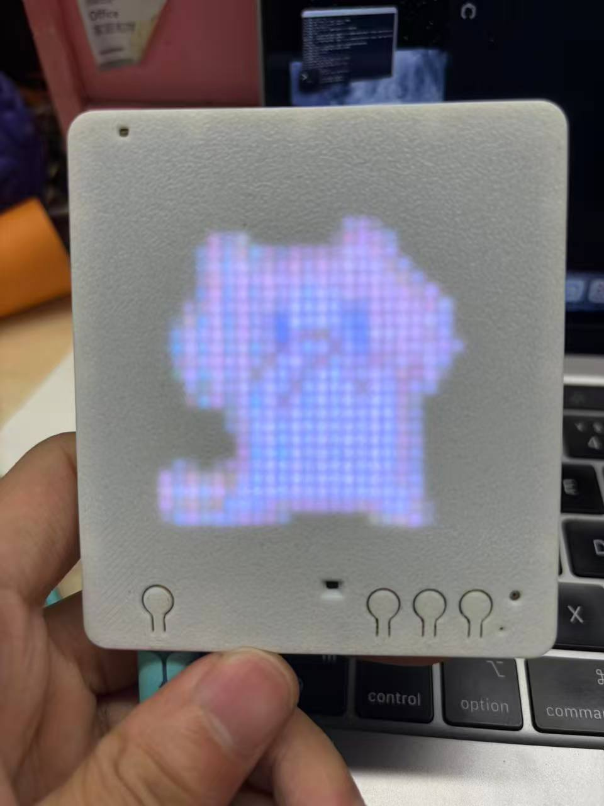
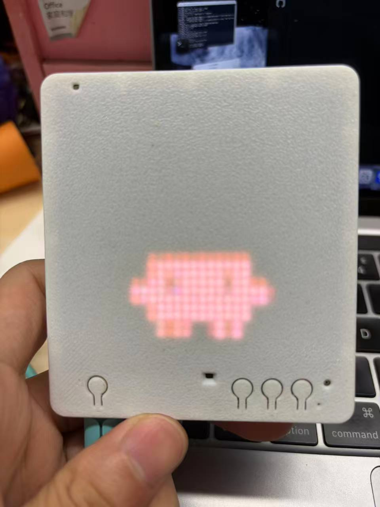
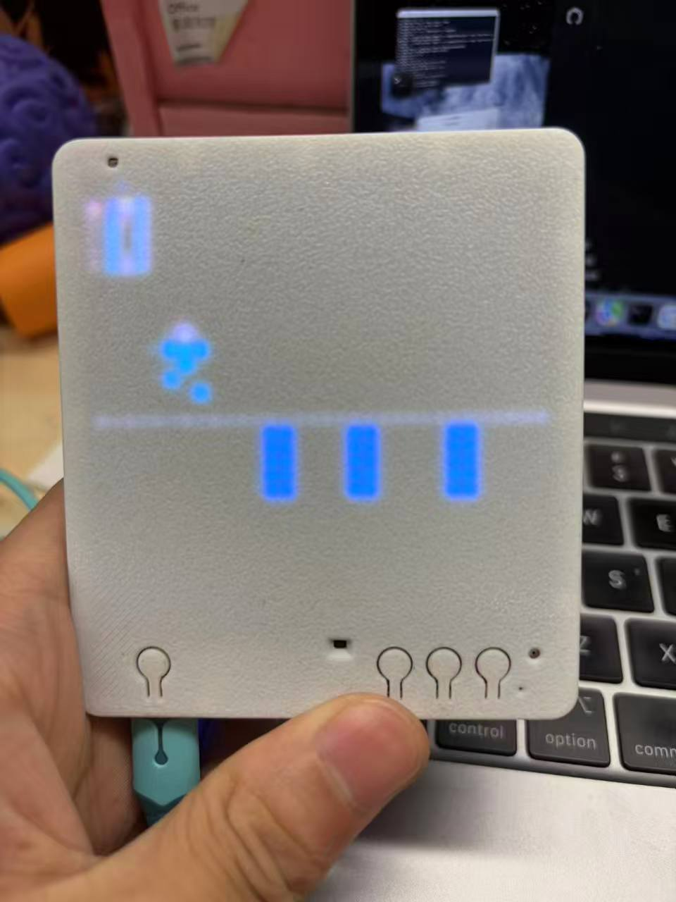
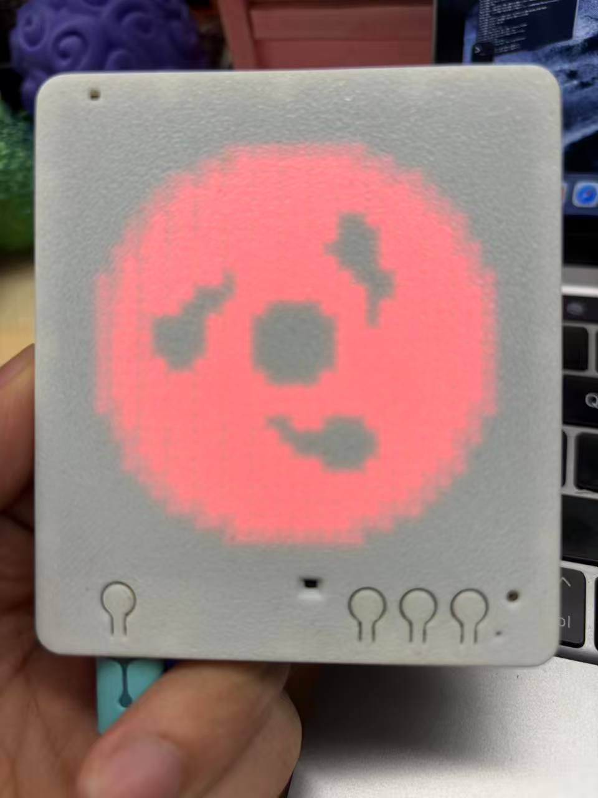
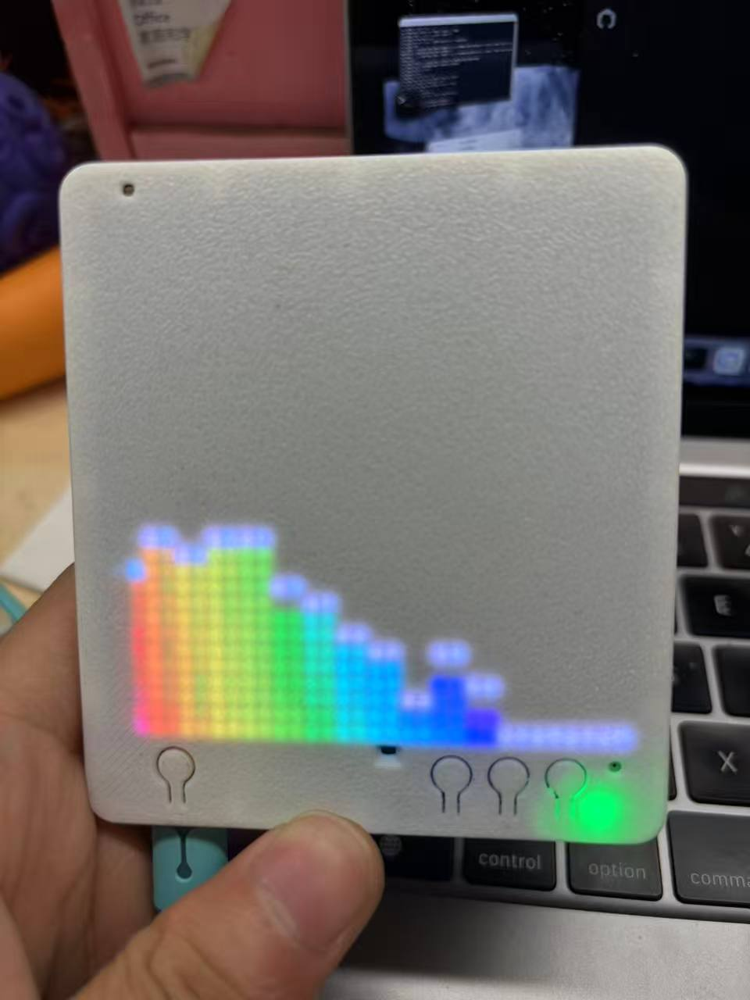
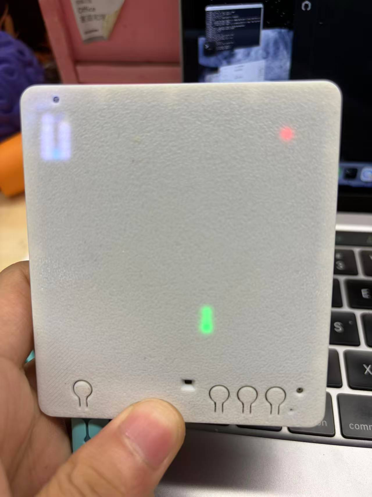
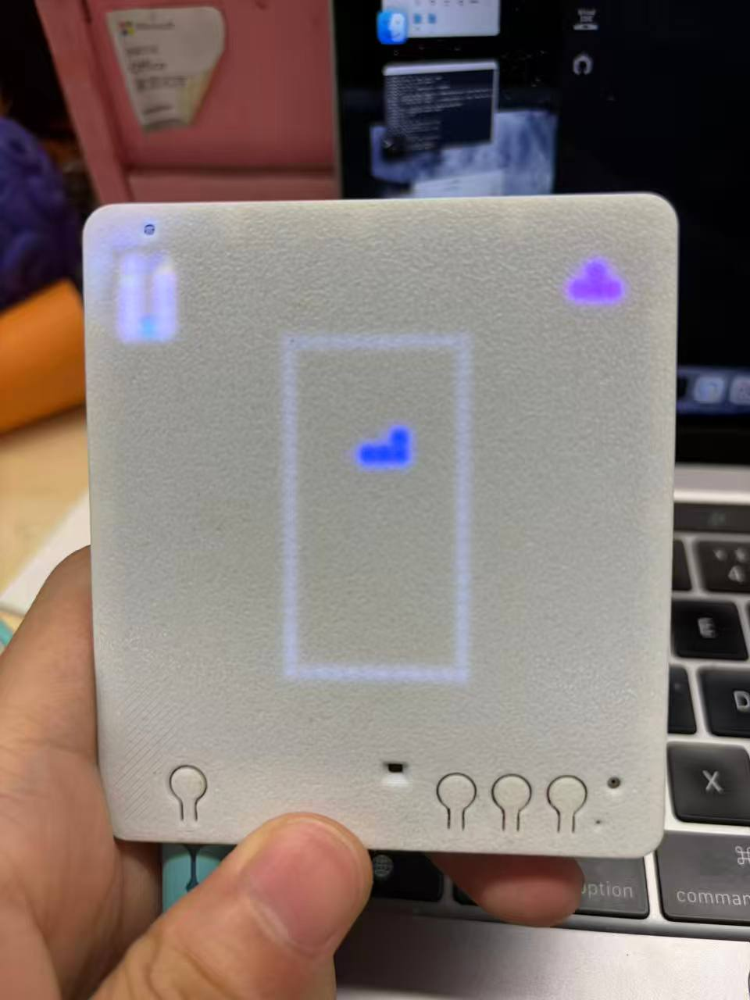
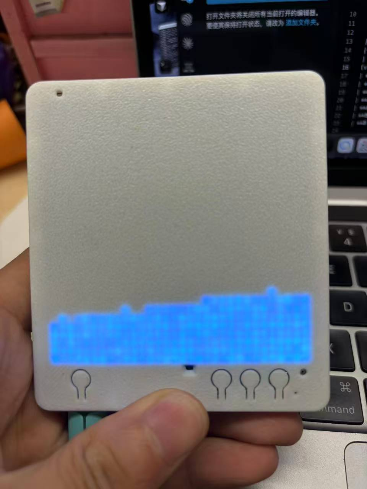

# T5 Pixel Agent Monitor（BLE 版）介绍与使用指南

> 适用硬件：涂鸦 **T5AI Pixel** 开发板（32×32 LED 矩阵 + OK / A / B 三键）

---

## 一、这是什么？

**T5 Pixel Agent Monitor（BLE 版）** 是一块放在桌面上的 **AI 编程助手状态屏**：当你在 **Cursor / Claude Code** 里写代码、跑工具、等权限时，板子上的 **Clawd 小螃蟹** 会跟着切换动画（思考、敲键盘、抛球、报错等）。

### 主要功能

| 按键 | 操作 |
|------|------|
| **OK 单击** | 切换动画（特效 / 像素画 / 写轮眼等）<br> |
| **OK 双击** | **进入 Agent Monitor**<br> |
| **OK 长按** | 进入忍者跑酷<br> |
| **A 单击** | 切换像素画<br> |
| **A 双击** | 进入 AI 语音频谱模式<br> |
| **A 长按** | 进入贪吃蛇<br> |
| **B 长按** | 进入俄罗斯方块<br> |
| **B 双击** | 进入沙盒模拟<br> |

## 快速开始

```bash
# 1. 编译烧录（TuyaOpen 根目录已 source export.sh）
cd apps/tuya_t5_pixel/tuya_t5_pixel_demo_ble
tos.py build
tos.py flash -p /dev/cu.wchusbserialXXXX   # 先停 Bridge
```

```bash
# 2. PC Bridge
cd tools/pixel-agent-bridge-ble
npm install                # 安装依赖
npm run setup:ble          # 安装 Python bleak：pip install bleak

npm run install-hooks      # 安装agent Hooks
    - **Claude Code**：`~/.claude/settings.json`（含权限阻塞 `/permission`）
    - **Cursor**：`~/.cursor/hooks.json`（仅状态同步）
    - 若存在 Codex / Copilot 目录，也会尝试写入

npm run scan:ble           # 扫描附件蓝牙设备
npm run bind:ble -- "xxx"  # 绑定板子 


常用启动方式：
npm start                  #推荐**：BLE 连上走无线；断线时串口兜底 
npm run start:ble          #仅蓝牙连接
npm run start:serial       #仅串口

# 3. 板子双击 OK → 进入 Agent 模式
```

健康检查：`curl http://127.0.0.1:23340/health`

## Bridge 命令速查

```bash
npm run start:dual          # 推荐
npm run start:ble           # 仅 BLE
npm run start:serial        # 仅串口
npm run scan:ble            # 扫描 TYBLE（列出 address）
npm run bind:ble -- "XXX"   # 绑定你的像素屏（防连错）
npm run list-ports          # 列出 WCH 串口
```

## 文档

| 文档 | 说明 |
|------|------|
| **[docs/USER_GUIDE.zh-CN.md](docs/USER_GUIDE.zh-CN.md)** | **完整介绍与使用指南**（推荐给新用户） |
| [patches/README.md](patches/README.md) | TuyaOpen SDK 补丁 |

原始项目(https://github.com/tuya/TuyaOpen/blob/master/apps/tuya_t5_pixel/README_CN.md)
硬件开源地址(https://oshwhub.com/tuyaopen/tuya-t5-pixels)
开发版购买(https://shorturl.asia/NLkcI)
结构外壳3D打印(https://makerworld.com.cn/zh/models/1827760-tuya-t5-pixels-kai-yuan-ai-xiang-su-ping?from=search#profileId-2020811)


## 目录

```
tuya_t5_pixel_demo_ble/
├── app_default.config          # 构建配置（BLE、AI STT 等）
├── src/
│   ├── tuya_main.c             # 主程序、按键、模式切换
│   ├── pixel_agent_bridge.c    # 串口行协议
│   ├── pixel_agent_ble.c       # BLE 传输与主题
│   └── pixel_agent_clawd.c     # Clawd GIF 渲染
├── tools/pixel-agent-bridge-ble/
│   ├── bridge.js               # HTTP 服务 + 串口 + BLE 调度
│   ├── ble_bridge.py           # Bleak BLE 子进程
│   ├── hooks/                  # IDE Hook 脚本
│   └── install-hooks.js        # 一键安装 Hook
├── dist/                       # 编译产物
└── docs/
    └── USER_GUIDE.zh-CN.md     # 文档
```